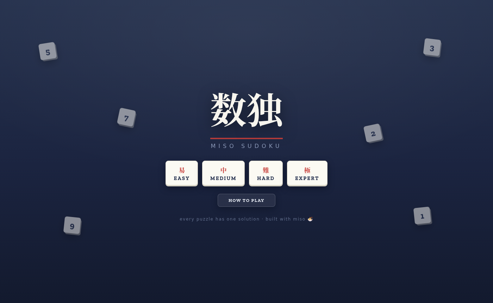
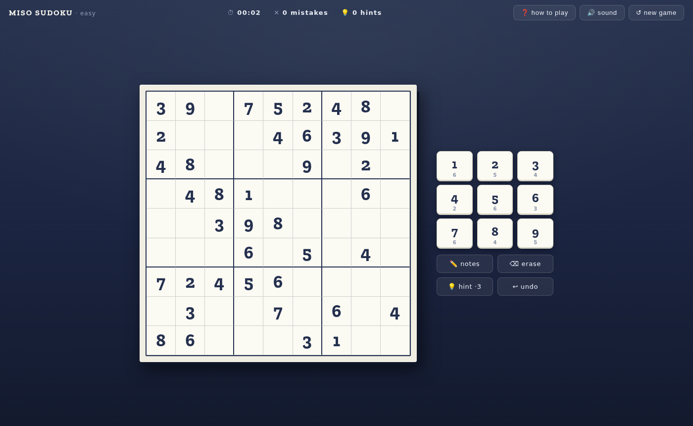

# 🔢 sudoku

**Sudoku** — four difficulties, every puzzle generated with exactly one
solution — built with [miso](https://github.com/dmjio/miso) and compiled
to WebAssembly.

**Play it live: <https://sudoku.haskell-miso.org>**





- 🎲 Puzzles generated in the browser: a randomized full grid, then dug
  out cell by cell while a solution-counting solver proves **uniqueness**
- 🎚 Easy / Medium / Hard / Expert (40 / 34 / 30 / 27 givens)
- 🖐 Drag digits from the pad onto cells — or tap, or type
- ✏️ Pencil notes with auto-sweep when a real digit lands nearby
- 🔴 Honest grading: only *visible* clashes get the red pen — a digit
  that merely disagrees with the hidden solution is left alone
- 💡 Three hints per game, unlimited undo, per-digit remaining counts
- ⌨️ Full keyboard play: 1–9, arrows, backspace, N for notes
- 🔊 Sound effects synthesized live with the Web Audio API (zero assets)
- 🏮 "Ink & paper" design: a slab-serif paper puzzle sheet on an indigo
  desk, printed givens vs. penciled entries, and a vermillion 正解 stamp
  when you solve it — built on `Miso.Lens`, `Miso.CSS`, and
  `Miso.CSS.Color`

## Build (WASM)

```bash
nix develop .#wasm --command make
make serve   # serves public/ on :8080
```

## Tests

The generator and solver are pure and tested natively:

```bash
cabal test
```

Checks include: solver correctness on known grids, and for seeded
generations at every difficulty — the solution grid is valid, the givens
agree with it, the given count hits its target, and the puzzle has
**exactly one** solution.

CI builds with nix and deploys `public/` to GitHub Pages on pushes to
`master`.
